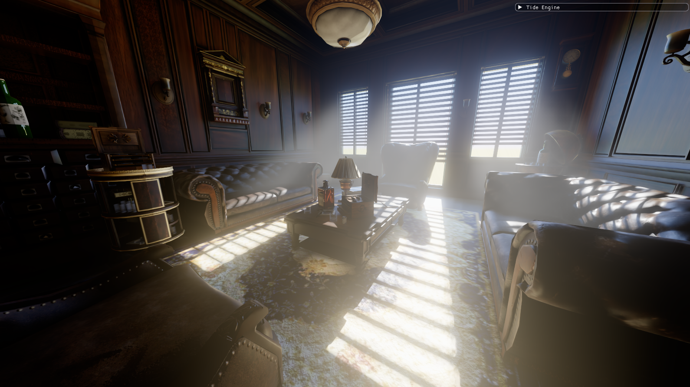
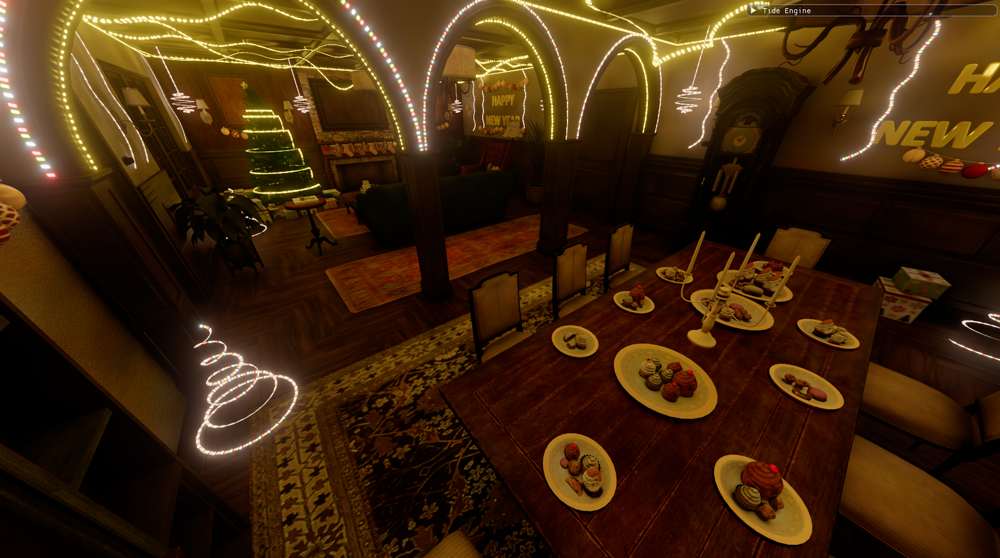

<div align="center">

# Tide Engine

**A modern Vulkan-based rendering engine focused on showcasing AAA graphics techniques and realtime performance.**

[](https://vulkan.org/)
[](https://isocpp.org/)
[](https://opensource.org/licenses/MIT)

</div>

## Overview

Tide Engine is a tech demo and learning project, built from scratch to explore modern rendering architectures such as hardware ray tracing, real-time GI, reflections etc. Rather than being a general-purpose game engine, it serves as a highly specialized playground for cutting-edge graphics implementations.



*(Render result showcasing RT Shadows, Volumetrics, and PBR)*

Video demos: [youtube.com/@osmanfatihcakr3435](https://www.youtube.com/@osmanfatihcakr3435)

## Rendering Features

*   **Renderer** - Vulkan 1.3 visibility buffer, bindless resources.
*   **Physically Based Rendering** - Cook-Torrance metallic-roughness.
*   **Ray Traced Shadows** - inline ray query (`VK_KHR_ray_query`).
*   **Shadow Denoising** - temporal, SVGF-lite, or DLSS 3.5 Ray Reconstruction.
*   **Realtime Global Illumination** - DDGI
*   **Ambient Occlusion** - ray traced ambient occlusion
*   **Reflections** - hybrid SSR and/or ray-traced reflection.
*   **Volumetric Fog** - froxel grid with RT-shadowed god rays.
*   **Transparency**
*   **Emissive Materials**
*   **Bloom** - dual-filter (COD/Jimenez) mip chain.
*   **Tonemapping** - ACES / AgX.

## Controls

| Input | Action |
|-------|--------|
| **Right Mouse (hold)** | Look around |
| **W / A / S / D** | Move forward / left / back / right |
| **Q / E** | Move down / up |
| **Left Shift (hold)** | Move faster |
| **F11** | Toggle borderless fullscreen |

## Building the Project

The engine is built entirely using **Visual Studio 2022**. 

1. Clone the repository with its submodules:
   ```bash
   git clone --recursive <repository_url>
   ```
   *(If you already cloned it without `--recursive`, run `git submodule update --init --recursive` in the project folder).*
2. Double-click **`setup.bat`** (or run it in the terminal) to automatically compile local dependencies (like GLFW).
3. Open the `Tide Engine.sln` solution file located in the root directory using Visual Studio 2022.
4. Make sure the target architecture is set to **x64** (Debug or Release).
5. Build the solution (`Ctrl + Shift + B`).
6. Run the project!

*Note: External libraries like GLFW, ImGui, Tracy, and GLM are included in the `Dependency/` directory. However, you **must** have the [Vulkan SDK](https://vulkan.lunarg.com/) installed. During the LunarG Vulkan SDK installation, make sure to explicitly select and install the following components:*
*   **Vulkan Memory Allocator (VMA)**
*   **Shaderc**
*   **Validation Layers**

## Acknowledgments / Credits

*   **Test Scene Asset:** The 3D environments used for testing and demonstrating the engine features is sourced from:
   - [Fab.com](https://www.fab.com/listings/4da78da6-44b3-4adf-8883-219fe17b44d4)
   - [Fab.com](https://www.fab.com/listings/8b8819e4-9278-45bb-865f-3ea8a332cc07)


## License

This project is licensed under the MIT License - see the LICENSE file for details.
