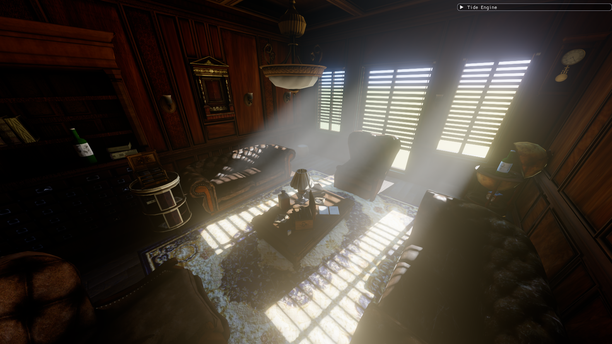

<div align="center">

# 🌊 Tide Engine

**A modern Vulkan-based rendering engine focused on showcasing AAA graphics techniques and realtime performance.**

[](https://vulkan.org/)
[](https://isocpp.org/)
[](https://opensource.org/licenses/MIT)

</div>

## 📌 Overview

Tide Engine is an ongoing tech demo and learning project, built from scratch to explore modern rendering architectures, hardware ray tracing, and advanced post-processing techniques. Rather than being a general-purpose game engine, it serves as a highly specialized playground for cutting-edge graphics implementations.


*(Render result showcasing RT Shadows, Volumetrics, and PBR)*

## ✨ Key Features

### 📐 Modern Rendering Pipeline
*   **Vulkan 1.3 Backend:** Utilizing modern Vulkan features, minimal overhead.
*   **Visibility Buffer Architecture:** Decoupled geometry and shading passes. Rasterizes visibility (instance + primitive ID) and uses compute shaders to reconstruct geometry and evaluate PBR lighting.
*   **Bindless Resources:** Heavy use of descriptor indexing and buffer device addresses to eliminate CPU binding overhead.

### ☀️ Ray Traced Shadows & Illumination
*   **Hardware Ray Tracing (Ray Query):** Exact, analytically correct soft shadows evaluated per-pixel via inline ray tracing (`VK_KHR_ray_query`).
*   **Physically Based Rendering (PBR):** Standard Cook-Torrance metallic-roughness workflow with ACES tonemapping.

### 🔍 Advanced Denoising Techniques
The engine supports interchangeable, mutually exclusive denoisers to clean up the noisy 1spp ray-traced shadow signals:
*   **Custom Temporal Accumulation:** Reprojection with EMA and depth-validation.
*   **SVGF-lite (A-Trous):** Edge-aware spatial blurring using normal and depth edge-stopping functions.
*   **NVIDIA DLSS 3.5 Ray Reconstruction:** Full integration of NGX to completely bypass local denoisers and utilize AI-driven temporal/spatial upscaling and noise reduction.

### 🌫️ Volumetric Fog (Froxel-based)
*   **3D Froxel Grid:** Computes participating media density and scattering across a 3D view-frustum volume.
*   **RT-Shadowed God Rays:** Each froxel evaluates ray-traced shadows to correctly handle light shafts (god rays) streaming through complex geometry.
*   **Temporal & Spatial Filtering:** Uses temporal reprojection, per-froxel jittering, and 3D blurring to resolve noise.
*   **Soft Depth Occlusion:** Prevents light leaking artifacts with precise depth-fading.

### 💡 Realtime Global Illumination (DDGI)
*   **World-Space Probe Grid:** A regular grid of irradiance probes wraps the scene; each probe traces rays into the TLAS to capture diffuse indirect light, replacing flat ambient with real sun bounces.
*   **Octahedral Irradiance & Depth Atlases:** Per-probe irradiance and depth/moments are encoded octahedrally into shared atlases, sampled with trilinear + normal-aware weighting.
*   **Multi-Bounce Feedback:** Probes re-sample the previous frame's irradiance at ray hits (RTXGI-style), so light energy accumulates over multiple bounces and naturally fills the room.
*   **Probe Classification (Leak-Free):** Probes that land inside or behind geometry are detected (via backface ray ratio) and excluded from interpolation, eliminating light leaks through thin walls with **zero per-pixel rays** — true to DDGI's amortized design. Combined with Chebyshev variance-depth visibility and temporal hysteresis.

### 🛠️ Developer Tools & Utilities
*   **Real-time UI:** Immediate feedback and variable tweaking via integrated ImGui.
*   **Profiling:** Deeply integrated Tracy CPU and GPU markers for granular performance analysis.
*   **State Persistence:** Saves and loads camera coordinates and environment settings on the fly.

## 🚧 Status (Work In Progress)

Tide Engine is currently **WIP**.
**Recently Landed:** **RT-based DDGI (Dynamic Diffuse Global Illumination)** — a world-space probe grid built on the existing TLAS now captures and injects dynamic multi-bounce indirect light, replacing the old flat ambient term with leak-free, ray-traced GI.
**Up Next:** Ambient occlusion and bloom/post-processing to round out the lighting pipeline.

## 🚀 Building the Project

The engine is built entirely using **Visual Studio 2022**. 

1. Clone the repository with its submodules:
   ```bash
   git clone --recursive <repository_url>
   ```
   *(If you already cloned it without `--recursive`, run `git submodule update --init --recursive` in the project folder).*
2. Double-click **`setup.bat`** (or run it in the terminal) to automatically compile local dependencies (like GLFW).
3. Open the `Tide Engine.sln` solution file located in the root directory using Visual Studio 2022.
4. Make sure the target architecture is set to **x64** (Debug or Release).
5. Build the solution (`Ctrl + Shift + B`).
6. Run the project!

*Note: External libraries like GLFW, ImGui, Tracy, and GLM are included in the `Dependency/` directory. However, you **must** have the [Vulkan SDK](https://vulkan.lunarg.com/) installed. During the LunarG Vulkan SDK installation, make sure to explicitly select and install the following components:*
*   **Vulkan Memory Allocator (VMA)**
*   **Shaderc**
*   **Validation Layers**

## 🤝 Acknowledgments / Credits

*   **Test Scene Asset:** The 3D environment used for testing and demonstrating the engine features is sourced from [Fab.com](https://www.fab.com/listings/4da78da6-44b3-4adf-8883-219fe17b44d4) (free-to-use).

## 📜 License

This project is licensed under the MIT License - see the LICENSE file for details.
